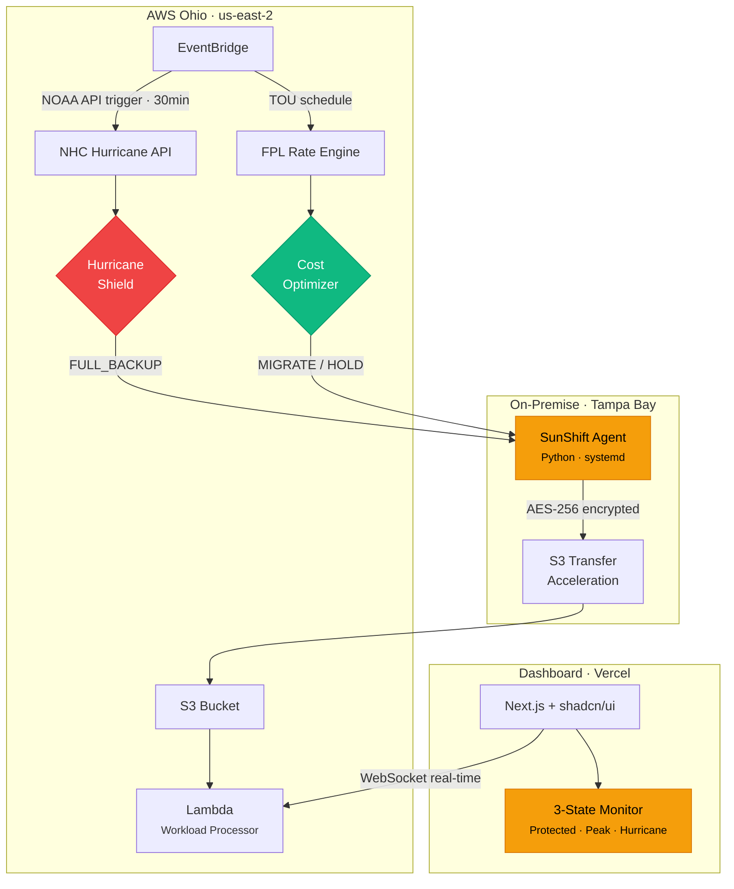

# ☀️ SunShift

**Shift your workloads. Shield your business.**

Hybrid cloud platform that auto-migrates workloads based on electricity pricing and hurricane alerts — built for Florida SMBs.

[-FF9900?logo=amazonwebservices&logoColor=white)](https://aws.amazon.com)
[](https://terraform.io)
[](https://python.org)
[](https://fastapi.tiangolo.com)
[](https://nextjs.org)
[](docs/adr/004-hipaa-compliance.md)
[](https://github.com/kaydenletk/sunshift/actions)
[]()

---

## The Problem

**60% of Florida SMBs never reopen after a natural disaster** (FEMA). Meanwhile, FPL Time-of-Use rates spike **4.5x during peak hours — from 6¢ to 27¢/kWh in summer** (June–September, 12PM–9PM). Enterprise disaster recovery and cost-optimization tools start at $250K+ (AWS Outposts, Nutanix) — completely out of reach for a 10-person accounting firm or medical practice.

SunShift is a hybrid cloud agent that runs on-premise, monitors electricity pricing and NOAA storm data in real time, and automatically migrates workloads to AWS Ohio before costs spike or a hurricane hits — then migrates them back when conditions normalize.

---

## Architecture



---

## Architecture Decisions

| ADR | Decision | Status |
|-----|----------|--------|
| [001](docs/adr/001-hybrid-cloud-architecture.md) | Hybrid cloud over full migration or on-prem only | Accepted |
| [002](docs/adr/002-aws-ohio-destination.md) | AWS Ohio (us-east-2) — 920mi from Tampa, zero hurricane risk | Accepted |
| [003](docs/adr/003-tou-based-scheduling.md) | ML-powered TOU scheduler with static fallback | Accepted |
| [004](docs/adr/004-hipaa-compliance.md) | Triple encryption + immutable audit logs for HIPAA | Accepted |
| [005](docs/adr/005-hurricane-shield.md) | Event-driven NOAA integration for pre-emptive backup | Accepted |

---

## Quick Start

```bash
git clone https://github.com/kaydenletk/sunshift.git
cd sunshift
make demo
```

Expected output:

```
[SunShift] Starting demo environment...
[SunShift] Dashboard:  http://localhost:3000
[SunShift] API docs:   http://localhost:8000/docs
[SunShift] Scheduler:  running (hybrid mode)
[SunShift] Demo ready. Simulating peak-hour migration...
```

---

## Tech Stack

| Pillar | Technologies |
|--------|-------------|
| Backend | Python 3.12, FastAPI, Celery, XGBoost, Prophet |
| Dashboard | Next.js 16, TypeScript, Tailwind CSS, shadcn/ui, Recharts |
| Infrastructure | Terraform, AWS (S3, Lambda, EventBridge, KMS, ECS) |
| Compliance | HIPAA (AES-256, BAA, audit logs), SOC 2 pathway |

---

## Project Structure

<details>
<summary>View directory tree</summary>

```
sunshift/
├── backend/           # FastAPI + ML scheduler
│   ├── api/           # REST endpoints
│   ├── services/      # Business logic (scheduler, cost engine)
│   └── models/        # Pydantic schemas
├── dashboard/         # Next.js monitoring UI
│   ├── components/    # React components (shadcn/ui)
│   └── app/           # App Router pages
├── docs/
│   └── adr/           # Architecture Decision Records
├── docker-compose.yml # One-command demo
└── Makefile           # Developer commands
```

</details>

---

## License

MIT License — see [LICENSE](LICENSE) for details.
